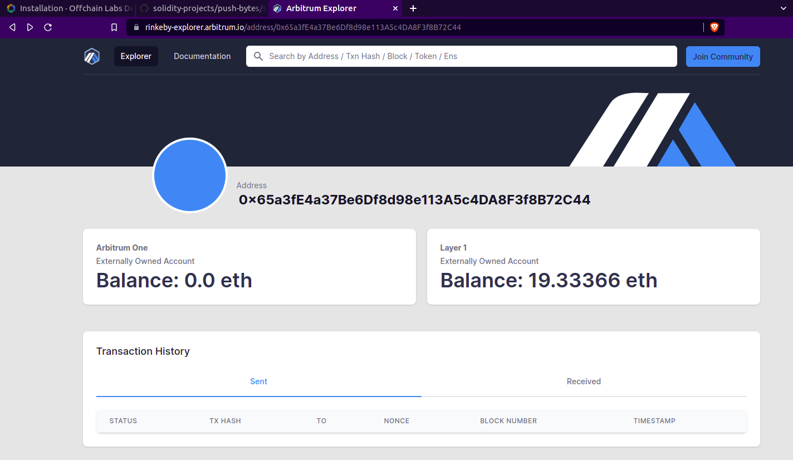
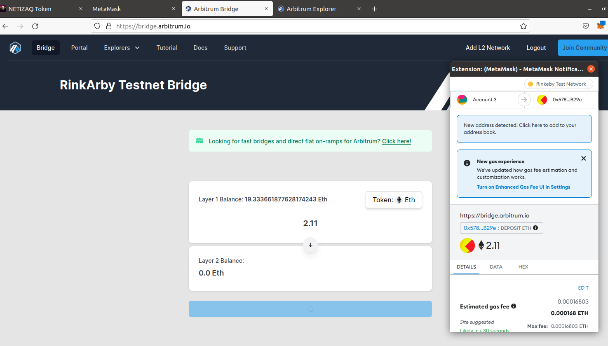

# PushBytes   
#### Contract is deployed on [Arbitrum](https://arbitrum.io/)

## Steps for deploying on Arbitrum:

1. Install Arbitrum on local machine -> [https://developer.offchainlabs.com/docs/installation](https://developer.offchainlabs.com/docs/installation).
2. Add `Arbitrum (public testnet)` network to Metamask ->  [https://developer.offchainlabs.com/docs/public_testnet](https://developer.offchainlabs.com/docs/public_testnet).
3. I'm using `0x65a3fE4a37Be6Df8d98e113A5c4DA8F3f8B72C44` address for testing and deployment. To see transactions, open `rinkeby-arbitrum` explorer: [https://rinkeby-explorer.arbitrum.io/](https://rinkeby-explorer.arbitrum.io/).

Right now, I am having about `19 ETH` on `Rinkeby testnet` and `0 ETH` on `Arbitrum One`    
   
4. Since, I don't have any balance on `Arbitrum One` chain, I'll use [Arbitrum Bridge](https://bridge.arbitrum.io/) to transfer ETH from `rinkeby` to `arbitrum one` chain.   
5. Connect the Metamask wallet and enter the ETH you want to transfer to your address on arbitrum one. Then press `Deposit button`. It will pop-up metamask to sign the transaction.   
 
6. After recieving ETH in arbitrum one chain, deploy the contract.  
7. I'm using [hardhat]() for deploying and Alchemy's RPC url.  
8. Here is the Contract -> https://rinkeby-explorer.arbitrum.io/address/0xcac7262e2466b120de8208c1372311cf57a02cfb    
9. Similar contract, I deployed on Kovan network and results were preety clear. Gas consumed on `Kovan Network` was `0.0014 ETH` whereas on `Arbitrum-Rinkeby` was `0.00009 ETH`.

<br />

Arbitrum Contract Address: [0xcac7262e2466b120de8208c1372311cf57a02cfb](https://rinkeby-explorer.arbitrum.io/address/0xcac7262e2466b120de8208c1372311cf57a02cfb)
Kovan Contract Address: [0x5a5a1047b0fbeed73e23a68d42a5d28ad20e7171](https://kovan.etherscan.io/address/0x5a5a1047b0fbeed73e23a68d42a5d28ad20e7171)

Gas Consumed on Arbitrum: **0.00009 ETH**
Gas Consumed on Kovan: **0.0014 ETH**   

<br />
<br />
<br />

# Basic Sample Hardhat Project

This project demonstrates a basic Hardhat use case. It comes with a sample contract, a test for that contract, a sample script that deploys that contract, and an example of a task implementation, which simply lists the available accounts.

Try running some of the following tasks:

```shell
npx hardhat accounts
npx hardhat compile
npx hardhat clean
npx hardhat test
npx hardhat node
node scripts/sample-script.js
npx hardhat help
```
