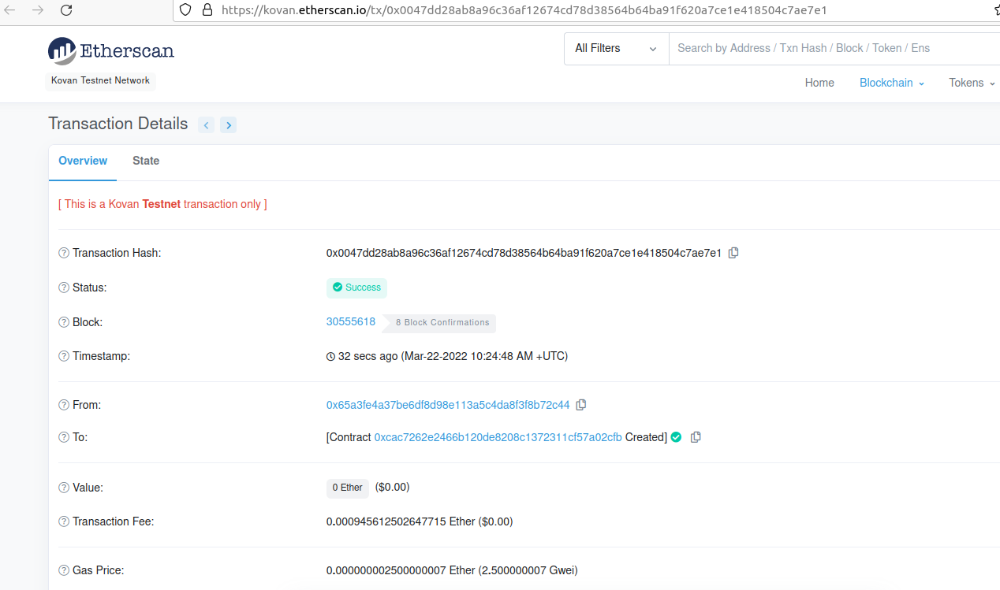
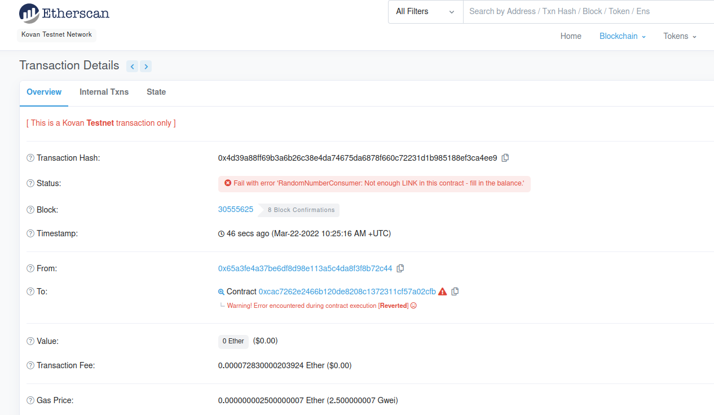
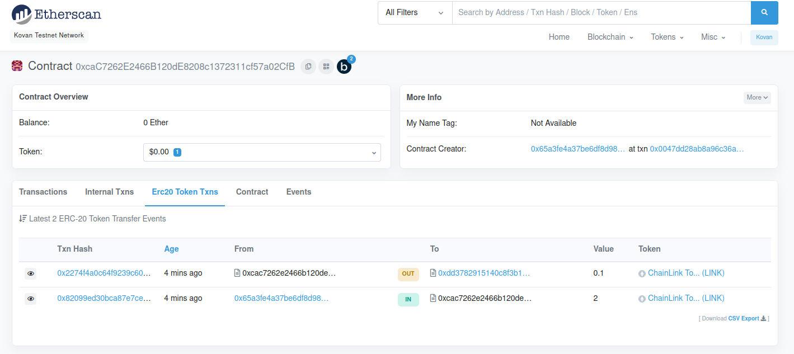
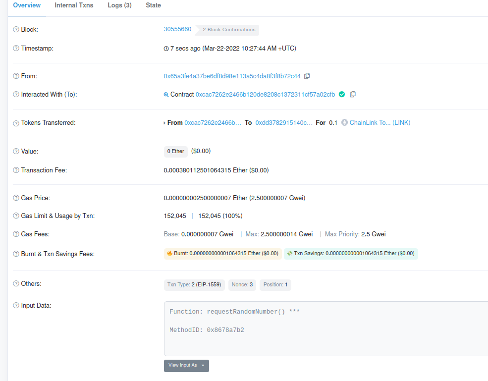
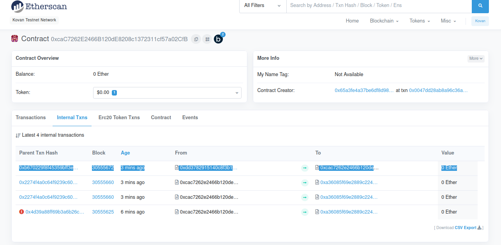

## Random number generation using Chainlink VRF - V1

Network: Kovan

Deployer's Address: `0x65a3fE4a37Be6Df8d98e113A5c4DA8F3f8B72C44`  
Contract Address: `0xcac7262e2466b120de8208c1372311cf57a02cfb`  

VRF Coordinator Address: `0xdD3782915140c8f3b190B5D67eAc6dc5760C46E9`  
LINK Token Address: `0xa36085F69e2889c224210F603D836748e7dC0088`  
KeyHash: `0x6c3699283bda56ad74f6b855546325b68d482e983852a7a82979cc4807b641f4`  
Fee: `0.1 * 10 ** 18`

----------------------

Process:
1. Deploy the contract to Kovan testnet.

 

2. Try calling the `requestRandomNumber` function and you will see the transaction reverted because, the smart contract has not LINK tokens yet. 
`Fail with error 'RandomNumberConsumer: Not enough LINK in this contract - fill in the balance.'`

 

3. So, send LINK tokens to smart contract's address.

 

4. Call `requestRandomNumber` function.

 

5. After some time, `VRF Coordinator` will callback `fulfillRandomness` function.

 